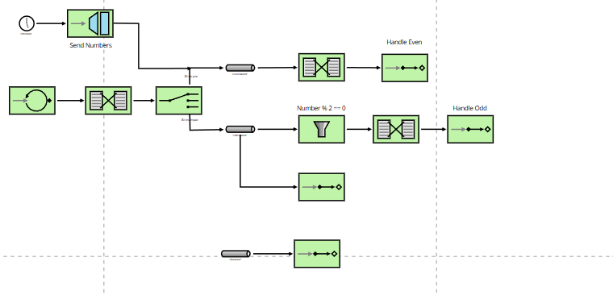

# Lab 5 Integration and SOA - Project Report

## 1. EIP Diagram (Before)

Describe what the starter code does and what problems you noticed.

---
The starter code classifies numbers from the AtomicInteger source and classifies them between odd and even numbers, some odd numbers
are rejected by an additional filter in oddFlow, all negative numbers are sent to evenChannel.

## 2. What Was Wrong

Explain the bugs you found in the starter code:

- **Bug 1**: What was the problem? Why did it happen? How did you fix it?
- Some odd numbers are rejected by the filter in oddFlow. I removed the filter in oddFlow, it wasn't necessary, myFlow already
filters between odd and even numbers.
- **Bug 2**: What was the second problem? Why did it happen? How did you fix it?
- Only some odd numbers are received by the Odd Service. Added Publish/Subscribe oddChannel, to allow multiple subscribers to
recieve the messages, in our case, the handler and the service.
- **Bug 3**: What was the third problem? Why did it happen? How did you fix it?
- All the negative numbers are being sent to evenChannel, even the ones that are odd. I added a numberChannel to the main flow, so
all the numbers are being sent to the flow and then classified as odd or even.
- **(More bugs if you found them)**

---

## 3. What You Learned

Write a few sentences about:

- What you learned about Enterprise Integration Patterns
- How to implement EIP using Spring Integration
- How Spring Integration works
- What was challenging and how you solved it
- The main difficulty I found what was the main function of the workflow and how different you can manage them. That's why
it took me so much time to inject numbers into the numberChannel from different sources, AtomicInteger and Gateway.

---

## 4. AI Disclosure

**Did you use AI tools?** (ChatGPT, Copilot, Claude, etc.)

- If YES: Which tools? What did they help with? What did you do yourself?
I did use ChatGPT to understand the given code, but the final implementation was done by myself.
- If NO: Write "No AI tools were used."

**Important**: Explain your own understanding of the code and patterns, even if AI helped you write it.

Positive numbers are generated every 100 ms, negatives every 1000ms. Negatives are sent to numberChannel by the gateway
due to being an external service. Positive numbers are sent into numberChannel by a flow which polls a number every
100 ms. Then, another flow takes numbers from numberChannel and routes them into evenChannel or oddChannel. After that,
evenChannel is received by its handler, on the other hand, oddChannel sends all numbers into the its handler and its 
service which its an external service too. 

There are different kinds of channels, direct and Publish/Subscribe. Direct,
only one reciever will recieve a message, Publish/Subscribe, copies a message to each reciever.

Flows can route, filter, transform and handle messages. 
    - Route send the message depending on the content of the message
    - Filter accepts or rejects messages into channels
    - Transform transforms the content of the message
    - Handle consumes messages

---

## Additional Notes

Any other comments or observations about the assignment.
